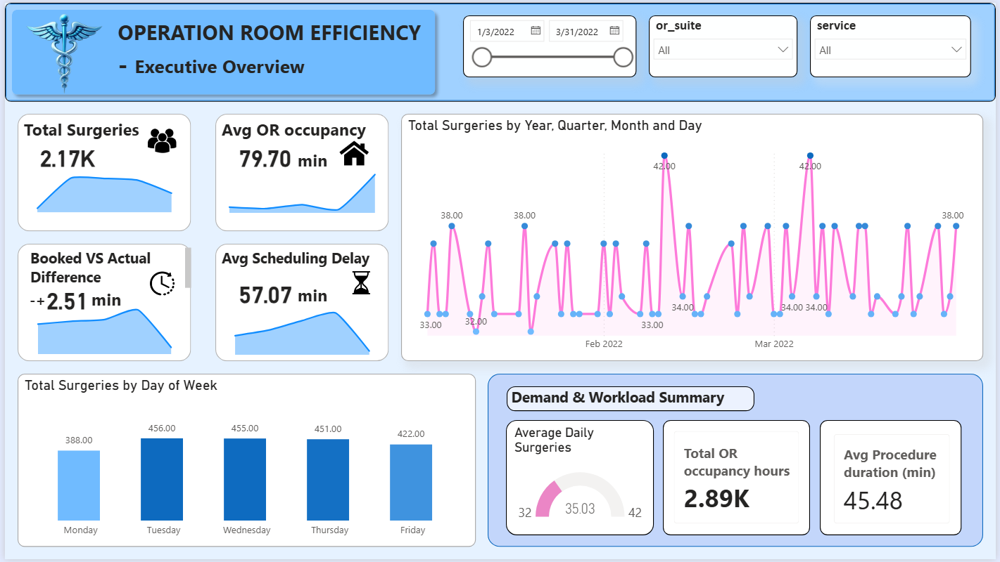
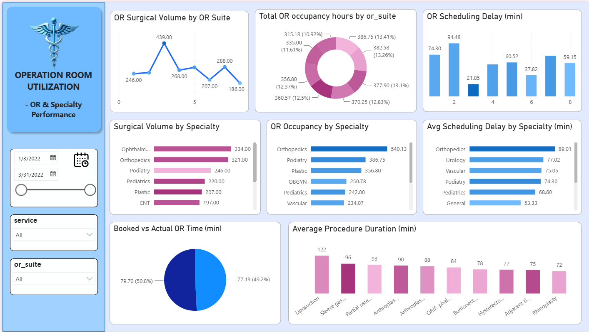
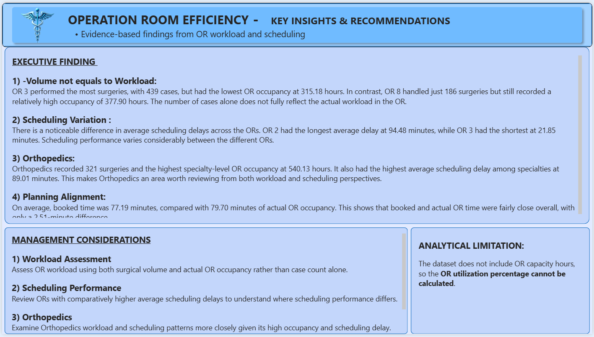

# Operating Room Efficiency Investigation

## Analysis of Surgical Delays, Operating Room Workload, Scheduling Performance, and Resource Utilization

## Project Overview

This project looks at Operating Room (OR) operations using surgical encounter data from a hospital.

The main aim was to understand where surgical workload and scheduling differences appear across OR suites and medical specialties, and to compare planned OR time with actual time used.

The project combines **data validation, PostgreSQL SQL analysis, Power BI dashboarding, and business-focused interpretation**.

---

## Business Problem

Operating Rooms are high-value hospital resources where surgical volume, procedure duration, occupancy, and scheduling performance all affect operational efficiency.

The analysis focuses on questions such as:

- Which OR suites handle the highest surgical workload?
- Which specialties contribute the most workload?
- Where are scheduling delays highest?
- How does actual OR occupancy compare with booked time?
- Which procedures are most frequent or longest in duration?
- How does performance vary across OR suites and specialties?

The objective is to identify measurable operational patterns that can support better planning, workload balancing, and management review.

---

## Dataset

The project uses the **Operating Room Utilization** dataset published on Kaggle by **The Devastator**, with the source credited to **Jennifer Falk**.

**Source:** https://www.kaggle.com/datasets/thedevastator/optimizing-operating-room-utilization

The analysis dataset contains **2,172 surgical encounters** covering **January 3, 2022 to March 31, 2022**.

### Dataset characteristics

- 2,172 surgical encounters
- 12 original columns
- 8 OR suites
- 10 medical services/specialties
- 32 CPT procedure types
- 62 operating dates
- No NULL values in the source dataset
- No duplicate encounter IDs

The repository includes the source CSV together with dataset metadata and attribution information.

---

## Analytical Approach

```text
Raw Dataset
     ↓
Data Validation
     ↓
SQL Preparation & Derived Metrics
     ↓
Exploratory SQL Analysis
     ↓
Business Insights & KPI Identification
     ↓
Power BI Dashboard
     ↓
Management Recommendations
```

### Key derived metrics

- **Procedure Duration** = Start Time → End Time
- **OR Occupancy** = Wheels In → Wheels Out
- **Schedule Delay** = Actual Start Time − Scheduled OR Time

Positive schedule delay indicates a late start, while a negative value indicates an early start.

---

## Key Findings

### 1. OR workload varies substantially across suites

OR 3 handled the highest number of surgeries with **439 cases**, while OR 8 handled the lowest with **186 cases**.

However, case volume alone does not represent total workload. OR occupancy hours provide an additional view of how much OR time was actually used.

### 2. Orthopedics has the highest specialty workload

Orthopedics recorded **321 surgeries** and approximately **540.13 hours of OR occupancy**, making it the largest specialty by occupancy in the dataset.

### 3. Scheduling delays differ considerably by OR and specialty

OR 2 recorded the highest average scheduling delay at approximately **94.48 minutes**, while OR 3 recorded the lowest at approximately **21.85 minutes**.

At specialty level, Orthopedics had the highest average delay at approximately **89.01 minutes**.

### 4. Booked time and actual occupancy are slightly different

Average booked time was **77.19 minutes**, compared with average actual OR occupancy of **79.70 minutes**, giving an average variance of approximately **+2.51 minutes**.

### 5. Daily surgical volume is relatively stable

The dataset contains an average of approximately **35.03 surgeries per operating day**, with daily volume ranging from **32 to 42 surgeries**.

### 6. Procedure mix affects OR workload

The most frequent procedure was **Extracapsular cataract removal**, with **334 cases**. The longest average procedure duration among the analyzed procedures was **Liposuction**, at approximately **122 minutes**.

---

## Power BI Dashboard

The final dashboard contains three pages.

### Page 1 — Executive Overview



Provides the main KPIs, daily surgical volume, and OR occupancy overview.

### Page 2 — OR & Specialty Performance



Compares OR suites and specialties across volume, occupancy, scheduling delay, and procedure duration.

### Page 3 — Key Insights & Recommendations



Summarizes the major analytical findings and management considerations.

---

## Tools & Technologies

| Tool | Purpose |
|---|---|
| **PostgreSQL** | Data preparation, validation, KPI calculations, and analysis |
| **SQL** | Exploratory analysis and business metric generation |
| **Power BI** | Interactive dashboard and KPI visualization |
| **Excel** | Supporting analysis and insight documentation |
| **GitHub** | Project versioning and portfolio presentation |

---

## Repository Structure

```text
Operating-Room-Efficiency-Investigation/
│
├── README.md
├── .gitignore
│
├── dataset/
│   ├── OR_Utilization.csv
│   └── dataset_metadata.md
│
├── SQL_Analysis/
│   ├── data_preparation.sql
│   ├── data_validation.sql
│   └── EDA_OR_utilization_analysis.sql
│
├── dashboard/
│   ├── power_bi_dashboard.pbix
│   ├── Executive_Overview.png
│   ├── OR_and_Specialty_Performance.png
│   └── Key_Insights_and_Recommendations.png
│
└── documentation/
    ├── OR_Efficiency_Project_Documentation.pdf
    └── OR_Efficiency_Project_Presentation.pptx
```

---

## SQL Analysis

The SQL workflow is organized into three stages:

1. `data_preparation.sql` — prepares the analysis table and derived fields.
2. `data_validation.sql` — checks data quality and timestamp consistency.
3. `EDA_OR_utilization_analysis.sql` — performs the main business and KPI analysis.

The SQL files are available in the [`SQL_Analysis`](SQL_Analysis/) folder.

---

## Important Analytical Limitation

The dataset does not provide the total available OR capacity hours for each suite. Therefore, a true **OR utilization percentage** cannot be calculated from this dataset.

The project instead uses **OR occupancy hours** as a workload measure.

This distinction is important: occupancy describes how much OR time was used, while utilization percentage requires both used time and available capacity.

---

## Dataset Source & Attribution

The source dataset is the **Operating Room Utilization** dataset published on Kaggle by **The Devastator**, with the source credited to **Jennifer Falk**.

[Kaggle dataset](https://www.kaggle.com/datasets/thedevastator/optimizing-operating-room-utilization)

The Kaggle dataset page provides the applicable attribution and ShareAlike terms. This repository retains the source attribution and dataset metadata so the origin and usage conditions remain clear.

---

## Disclaimer

This project is an analytical portfolio project. The findings describe patterns present in the supplied dataset and should not be interpreted as proof of specific operational causes that are not directly measured in the data.

For example, the analysis does not establish that staffing shortages, equipment issues, surgeon performance, cleaning delays, or patient complexity caused observed delays because those factors are not available in the dataset.

---

## Project Documentation

Additional project documentation and the presentation are available in the `documentation/` folder.

The documentation covers the business problem, methodology, data validation, SQL analysis, Power BI dashboard, findings, limitations, and management considerations.

---

## Author

**Pawan Dhobale**

Data Analytics Portfolio Project — Healthcare Operations Analytics
